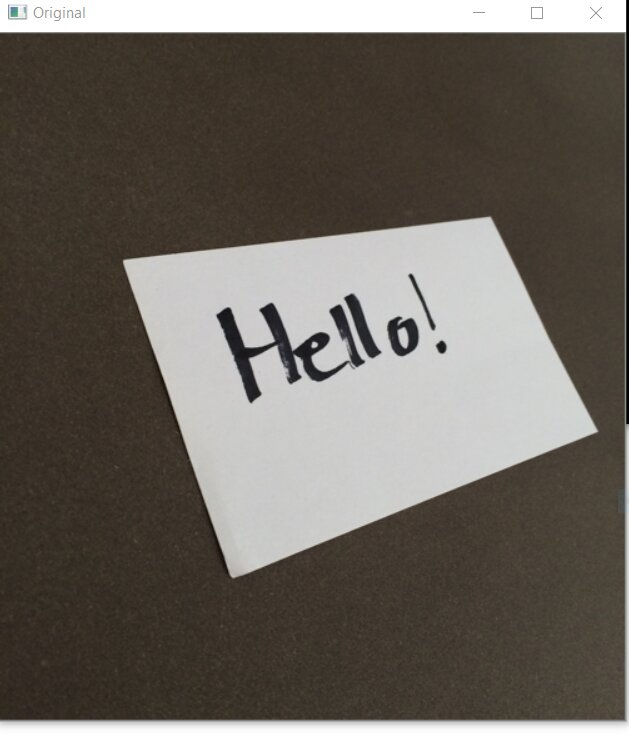

# Bird-eye-view

>
 #### Perspective-Transformation 

 When human eyes see near things they look bigger as compare to those who are far away. This is called perspective in a general way. Whereas transformation is the transfer of an object e.t.c from one state to another. So overall, the perspective transformation deals with the conversion of 3d world into 2d image. The same principle on which human vision works and the same principle on which the camera works.

 #### 4 point perspective transform / Bird eye view

 Mainly deals with converting image into bird eye view or top down form 

 ## Input image :
 

 ## Output images:
 ## Original image  v/s   Bird eye view image(wraped)

                             

